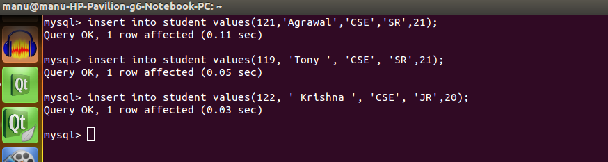

# MySQL User guide

1. **How to install Mysql?**
     * **With internet connection:** 
	    1. **Using terminal:**

			 To install MySQL, run the following command from a terminal prompt: 
	
			<b>*sudo apt-get install mysql-server*</b>
       
			During the installation process you will be prompted to enter a password for the MySQL root user.
Once the installation is complete, the MySQL server should be started automatically. You can run the following command from a terminal prompt to check whether the MySQL server is running: 

			*<b>sudo netstat -tap | grep mysql</b>*

			When you run this command, you should see the following line or something similar: 

			*<b><pre>tcp   0   0 localhost:mysql       `*`:`*`        LISTEN 2556/mysqld</pre></b>*
			If the server is not running correctly, you can type the following command to start it: 

			*<b>sudo /etc/init.d/mysql restart</b>*

	     2. **Using Ubuntu software Center:**
		
			Open ubuntu softaware centre, type Mysql Server in search, Click Install.

	* **Offline installation:**
		1. **Using terminal: **

			a. Download or acquire the deb packages of mysql. 
http://dev.mysql.com/downloads/mysql/5.6.html
http://packages.ubuntu.com/quantal/multiarch-support

			b. Copy it in a empty folder.
		
			c. Go to to the empty folder path through terminal and type 
		
			*<b>sudo dpkg -i *.deb</b>*
		
		2. **Using Ubuntu software Center:**

			a. Right click the deb package and click open through ubuntu software centre.

2. **To get Mysql Prompt in Terminal**

		Type the following command to get MySQL prompt :

			mysql -u root -p

			Enter the Mysql password 

			root123

			NOTE: mysql refers to command

			-u root -p refers to user root password
	
				>>login to MySQL as root user(u) with mysql password(p).

3. **Creation of Database and query execution.**
	1. You will get the MySQL prompt as shown below:

		 

	2. Database Object Creation:
		* To create Database 

			CREATE DATABASE Student;

		* To Use Database

			USE Student;

		* To view the databases

			SHOW DATABASES;

		 

	3. Table Creation: 
		
			CREATE TABLE student(
			snum INT(4) PRIMARY KEY,
			sname varchar(10),
			major VARCHAR(10),
			lev VARCHAR(2),
			age INT(2)); 

			CREATE TABLE faculty(
			fid INT(4) PRIMARY KEY,
			fname VARCHAR(10),
			deptid INT(2)); 

			CREATE TABLE class(
			cname VARCHAR(10) PRIMARY KEY,
			meetat varchar(10),
			room VARCHAR(4),
			fid INT(4) REFERENCES faculty(fid)); 

			CREATE TABLE enrolled(
			snum INT(4) REFERENCES student(snum),
			cname VARCHAR(10) REFERENCES class(cname)); 

		 

	4. Inserting values into Table:

			INSERT INTO student (snum,sname,major,lev,age) values(121,'Agrawal','CSE','SR',21);

			INSERT INTO student (snum,sname,major,lev,age) values(119, 'Tony ', 'CSE', 'SR',21);

			INSERT INTO student (snum,sname,major,lev,age) values(122, ' Krishna ', 'CSE', 'JR',20);

		 

	5. to execute Query;

			To find the author1 of the book which has maximum sales:

			SELECT author1_name
			FROM author1 a,catalogue1 c
			WHERE a.author1_id=c.author1_id AND book_id IN (
				SELECT book_id
				FROM orderdetails1
				WHERE quantity= (
					SELECT MAX(quantity) FROM orderdetails1)
					);

		 

	6. To get the tables information use DESC command.

		 

	7. Contents of the table can be viewed by using the command SELECT as follows:

		 

	8. In between if user wants to clear the screen of the terminal then press:
ctrl+l.

	9. To get any information about the commands used in the mysql use "help" command.
		Eg: HELP INSERT;
		HELP CREATE;
	10. Type exit to exit from the MySQL prompt.

		Note 1 : MYSQL is a a case sensitive.
			Ex: "DESC MEMBERS" is differ from "DESC members".

		 

		Note 2:

<TABLE border="1" width="75%" align="center">
    <TR>
        <TH COLSPAN=2>Handy MySQL Commands</TH>
    </TR>
    <TR>
        <TD>Description
        </TD>
        <TD>Command
        </TD>
    </TR>
    <TR>
        <TD>To login (from unix shell) use -h only if needed.
        </TD>
        <TD>[mysql dir]/bin/mysql -h hostname -u root -p</TD>
    </TR>
    <TR>
        <TD>Create a database on the sql server.
        </TD>
        <TD>CREATE DATABASE [databasename];
        </TD>
    </TR>
    <TR>
        <TD>List all databases on the sql server.
        </TD>
        <TD>SHOW DATABASES;
        </TD>
    </TR>
    <TR>
        <TD>Switch to a database.
        </TD>
        <TD>USE [db name];USE [db name];USE [db name];
        </TD>
    </TR>
    <TR>
        <TD>To see all the tables in
            the db.
        </TD>
        <TD>SHOW TABLES;
        </TD>
    </TR>
    <TR>
        <TD>To see database's field
            formats.
        </TD>
        <TD>DESCRIBE [tadescribe [table name];
        </TD>
    </TR>
    <TR>
        <TD>To delete a db.
        </TD>
        <TD>DROP TABLE [database
            name];
        </TD>
    </TR>
    <TR>
        <TD>To delete a table.
        </TD>
        <TD>DROP TABLE [table name];
        </TD>
    </TR>
    <TR>
        <TD>Show all data in a table.
        </TD>
        <TD>SELECT * FROM [table name];
        </TD>
    </TR>
    <TR>
        <TD>Show only N number of rows from table.
        </TD>
        <TD>SELECT * FROM [table name] LIMIT N;
        </TD>
    </TR>
    <TR>
        <TD>Show fix N of rows from table starting from Mth record
        </TD>
        <TD>SELECT * FROM [table name] LIMIT N OFFSET M;
        </TD>
    </TR>
    <TR>
        <TD>Returns the columns and
            column information pertaining to the designated table.
        </TD>
        <TD>SHOW COLUMNS FROM [table name]; 
        </TD>
    </TR>
    <TR>
        <TD>Show certain selected rows
            with the value &quot;whatever&quot;.
        </TD>
        <TD>SELECT * FROM [table name]  
            WHERE [field name] = &quot;whatever&quot;;  
            </TD>
    </TR>
    <TR>
        <TD>Show all records
            containing the name &quot;Bob&quot; AND the phone number
            '3444444'.
        </TD>
        <TD>SELECT *  
        	FROM [table name]  
            WHERE name = &quot;Bob&quot;  
            AND phone<em>number = '3444444';  
        </TD>
    </TR>
    <TR>
        <TD>Show all records not
            containing the name &quot;Bob&quot; AND the phone number '3444444'
            order by the phone</em>number field.
        </TD>
        <TD>SELECT *  
        	FROM [table name]  
            WHERE name != &quot;Bob&quot;  
            AND phone<em>number = '3444444'  
            order by phone number</em>;  
        </TD>
    </TR>
    <TR>
        <TD>Show all records starting
            with the letters 'bob' AND the phone number '3444444'.
        </TD>
        <TD>SELECT *  
        	FROM [table name]  
            WHERE name like &quot;Bob%&quot;  
            AND phone<em>number = '3444444'; </em>
        </TD>
    </TR>
    <TR>
        <TD>Use a regular expression
            to find records. Use &quot;REGEXP BINARY&quot; to force
            case-sensitivity. This finds any record beginning with a. 
        </TD>
        <TD>SELECT * FROM [table name]
            WHERE rec RLIKE &quot;^a$&quot;; 
        </TD>
    </TR>
    <TR>
        <TD>Show unique records.
        </TD>
        <TD>SELECT DISTINCT [column
            name] FROM [table name];
        </TD>
    </TR>
    <TR>
        <TD>Show selected records
            sorted in an ascending (asc) or descending (desc).
        </TD>
        <TD>SELECT [col1],[col2] FROM
            [table name] ORDER BY [col2] DESC;
        </TD>
    </TR>
    <TR>
        <TD>Count number of rows.
        </TD>
        <TD>SELECT COUNT(*) FROM
            [table name]; 
        </TD>
    </TR>
    <TR>
        <TD>Join tables on common
            columns.
        </TD>
        <TD>SELECT 
            lookup.illustrationid, lookup.personid, person.birthday FROM
            lookup LEFT JOIN person ON
            lookup.personid=person.personid=statement TO JOIN birthday IN
            person table with primary illustration id;
        </TD>
    </TR>
    <TR>
        <TD>Switch to the mysql db.
            Create a new user. 
        </TD>
        <TD>INSERT INTO [table name]
            (Host,User,Password) VALUES('%','user',PASSWORD('password'));
        </TD>
    </TR>
    <TR>
        <TD>Change a users
            password.(from unix shell).
        </TD>
        <TD>[mysql dir]/bin/mysqladmin
            -u root -h hostname.blah.org -p password 'new-password'
        </TD>
    </TR>
    <TR>
        <TD>Change a users
            password.(from MySQL prompt).
        </TD>
        <TD>SET PASSWORD FOR
            'user'@'hostname' = PASSWORD('passwordhere');
        </TD>
    </TR>
    <TR>
        <TD>Switch to mysql db.Give
            user privilages for a db.
        </TD>
        <TD>INSERT INTO [table name]
            (Host,Db,User,Select</em>priv,Insert<em>priv,Update</em>priv,Delete<em>priv,Create</em>priv,Drop<em>priv)
            VALUES ('%','db','user','Y','Y','Y','Y','Y','N');
        </TD>
    </TR>
    <TR>
        <TD>To update info already in
            a table.
        </TD>
        <TD>UPDATE [table name] SET
            [column name]=[new value] WHERE [column name]=[value]
        </TD>
    </TR>
    <TR>
        <TD>Delete a row(s) from a
            table.
        </TD>
        <TD>DELETE from [table name]
            where [field name] = 'whatever';
        </TD>
    </TR>
    <TR>
        <TD>Update database
            permissions/privilages.
        </TD>
        <TD>FLUSH PRIVILEGES;
        </TD>
    </TR>
    <TR>
        <TD>Delete a column.
        </TD>
        <TD>ALTER TABLE [table name]
            DROP COLUMN [column name];
        </TD>
    </TR>
    <TR>
        <TD>Add a new column to db.
        </TD>
        <TD>ALTER TABLE [table name]
            ADD COLUMN [new column name] varchar (20);      </TD>
    </TR>
    <TR>
        <TD>Change column name. 
        </TD>
        <TD>ALTER TABLE [table name]
            CHANGE [old column name] [new column name] varchar (50); 
        </TD>
    </TR>
    <TR>
        <TD>Make a unique column so
            you get no dupes. 
        </TD>
        <TD>ALTER TABLE [table name]
            ADD UNIQUE ([column name]); 
        </TD>
    </TR>
    <TR>
        <TD>Make a column bigger. 
        </TD>
        <TD>ALTER TABLE [table name]
            MODIFY [column name] VARCHAR(3); 
        </TD>
    </TR>
    <TR>
        <TD>Delete unique from table. 
        </TD>
        <TD>ALTER TABLE [table name]
            DROP INDEX [colmn name]; 
        </TD>
    </TR>
    <TR>
        <TD>Load a CSV file into a
            table. 
        </TD>
        <TD>LOAD DATA INFILE
            '/tmp/filename.csv' replace INTO TABLE [table name] FIELDS
            TERMINATED BY ',' LINES TERMINATED BY '\n' (field1,field2,field3); </TD>
    </TR>
    <TR>
        <TD>Dump all databases for
            backup. Backup file is sql commands to recreate all db's. 
        </TD>
        <TD>[mysql dir]/bin/mysqldump
            -u root -ppassword --opt &gt;/tmp/alldatabases.sql 
        </TD>
    </TR>
    <TR>
        <TD>Dump one database for
            backup. 
        </TD>
        <TD>[mysql dir]/bin/mysqldump
            -u username -ppassword --databases databasename
            &gt;/tmp/databasename.sql 
        </TD>
    </TR>
    <TR>
        <TD>Dump a table from a
            database. 
        </TD>
        <TD>[mysql dir]/bin/mysqldump
            -c -u username -ppassword databasename tablename &gt;
            /tmp/databasename.tablename.sql 
        </TD>
    </TR>
    <TR>
        <TD>Restore database (or
            database table) from backup. 
        </TD>
        <TD>[mysql dir]/bin/mysql -u
            username -ppassword databasename &lt; /tmp/databasename.sql  
        </TD>
    </TR>
    <TR>
        <TD>Create Table Example 1. 
        </TD>
        <TD>CREATE TABLE [table name]
            (firstname VARCHAR(20), middleinitial VARCHAR(3), lastname
            VARCHAR(35),suffix VARCHAR(3), officeid VARCHAR(10),userid
            VARCHAR(15),username VARCHAR(8),email VARCHAR(35),phone
            VARCHAR(25), groups  VARCHAR(15),datestamp DATE,timestamp
            time,pgpemail VARCHAR(255)); 
        </TD>
    </TR>
    <TR>
		  <TD>Create Table Example 2. 
        </TD>
        <TD>CREATE TABLE [table name]
            (personid INT(50) NOT NULL AUTO_INCREMENT PRIMARY KEY,
            firstname VARCHAR(35),
            middlename VARCHAR(50),
            lastname VARCHAR(50) DEFAULT 'bato');
             
        </TD>
    </TR>
</TABLE>

### Advantages of MySQL:
1. MySQL is the widely used open source database. MySQL is the backend database of most of the websites. 
2. As a Free Software(Free as in freedom), MySQL can be downloaded and used by the developer for free. 
3. MySQL is robust and it provides excellent performance due to usage of MyISAM. 
4. MySQL occupies very less disk space. 
5. MySQL can be easily installed in all major operating systems like Microsoft Windows, Linux, UNIX. 
6. MySQL can be easily learnt using the tutorials that are available on internet. We would recommend users to go through the Spoken Tutorial videos given below to get more information on MySQL.
7. MySQL is best suited for small and medium applications. 

### Resources

* Please go through the video tutorials on MySQL developed and released by **Spoken Tutorial Project**, an initiative of National Mission on Education through ICT, Government of India, to promote IT literacy through Open Source Software. Students can go through these video tutorials to get better understanding of the subject. The tutorials for MySQL can be downloaded from [here](http://files.spoken-tutorial.org/disc-source/php-mysql-english-hindi.zip). More info about the project can be found [here](http://spoken-tutorial.org/).

* The MySQL Handbook is also available in the mysql-doc-5.0 package. To install the package enter the following in a terminal: 
	*<b>sudo apt-get install mysql-doc-5.0</b>*
* The documentation is in HTML format, to view them enter file:///usr/share/doc/mysql-doc-5.0/refman-5.0-en.html-chapter/index.html in your browser's address bar. 
