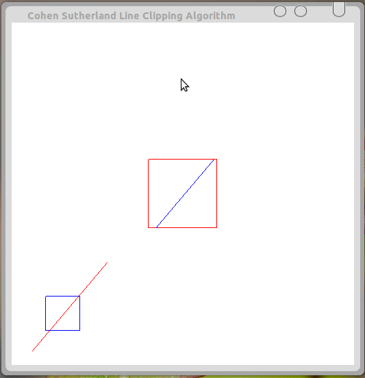

## Aim: Program to implement the Cohen-Sutherland line-clipping algorithm. Make provision to specify the input line, window for clipping and view port for displaying the clipped image.

## Algorithm:
1. End-points pairs are check for trivial acceptance or trivial rejected using the outcode.
2. If not trivial-accepance or trivial-rejected, divided into two segments at a clip edge.
3. Iteratively clipped by testing trivial-acceptance or trivial-rejected, and divided into two segments until completely 	inside or trivial-rejected.
4. To perform trivial accept and reject tests, we extend the edges of the clip rectangle to divide the plane of the clip rectangle into nine regions. Each region is assigned a 4-bit code deteermined by where the region lies with respect to the outside halfplanes of the clip-rectangle edges. Each bit in the outcode is set to either 1 (true) or 0 (false); the 4 bits in the code correspond to the following conditions:
	* Bit 1 : outside halfplane of top edge, above top edge
Y > Ymax
	* Bit 2 : outside halfplane of bottom edge, below bottom edge
Y < Ymin
	* Bit 3 : outside halfplane of right edge, to the right of right edge
X > Xmax
	* Bit 4 : outside halfplane of left edge, to the left of left edge
X < Xmin 

## Theory
> In computer graphics, 'line clipping' is the process of removing lines or portions of lines outside of an area of interest. Typically, any line or part thereof which is outside of the viewing area is removed.
> The Cohen�Sutherland algorithm is a computer graphics algorithm used for line clipping. The algorithm divides a two-dimensional space into 9 regions (or a three-dimensional space into 27 regions), and then efficiently determines the lines and portions of lines that are visible in the center region of interest (the viewport).
> The algorithm quickly detects and dispenses with two common and trivial cases. To clip a line, we need to consider only its endpoints. If both endpoints of a line lie inside the window, the entire line lies inside the window. It is trivially accepted and needs no clipping. On the other hand, if both endpoints of a line lie entirely to one side of the window, the line must lie entirely outside of the window. It is trivially rejected and needs to be neither clipped nor displayed.

## Code: cohenSutherland.c
	#include<stdio.h>
	#include<GL/glut.h>

    // outcode is same as int
	#define outcode int		
	
	// window boundary
	double xmin=50,ymin=50,xmax=100,ymax=100;
	
	// viewport boundary
	double xvmin=200,yvmin=200,xvmax=300,yvmax=300;
	
	// bitcode for the right,left,top & bottom
	const int RIGHT=8;	// 8 is 1000
	const int LEFT=2;	// 2 is 0010
	const int TOP=4;	// 4 is 0100
	const int BOTTOM=1;	// 1 is 0001
	int x1,x2,y1,y2;
    
    // used to compute bitcode of a point
	outcode ComputeOutcode(double x,double y);

	// Cohen-Sutherland clipping algo clips a line from 
	// P0=(x0,y) to P1=(x1,y1) against a rectangle with 
	// diagonal from (xmin,ymin) to (xmax,ymax)
	void CohenSutherlandLineClipAndDraw(double x0,double y0,double x1,double y1)
	{	
		outcode outcode0,outcode1,outcodeOut;
		bool accept=false,done=false;
		
		// compute outcodes
		outcode0=ComputeOutcode(x0,y0);
		outcode1=ComputeOutcode(x1,y1);
		do
		{
		    // logical or is 0 Trivially accept & exit
			if(!(outcode0|outcode1)) 
			{
				accept=true;
				done=true;
			}
			
			// logical and is not 0.Trivially reject & exit
			else if(outcode0 & outcode1) 
			{
				done=true;
			}
			else
			{
				// failed both tests,so calculate the line segment to clip 
				// from an outside point to an intersection with clip edge
				double x,y;
				
				//Atleast one endpoint is outside the clip rectangle,pick it.
				outcodeOut=outcode0?outcode0:outcode1;
				
				//Now find the intersection point
				//use formula y=y0+slope*(x-x0), x=x0+(1/slope)*(y-y0)
				//point is above the rectangular clip
				if(outcodeOut & TOP) 
				{
					x=x0+(x1-x0)*(ymax-y0)/(y1-y0);
					y=ymax;
				}
				
				// point is below the clip rectangle
				else if(outcodeOut & BOTTOM) 
				{
					x=x0+(x1-x0)*(ymin-y0)/(y1-y0);
					y=ymin;
				}
				
				// point lies right of clipping rectangle
				else if(outcodeOut & RIGHT) 
				{
					y=y0+(y1-y0)*(xmax-x0)/(x1-x0);
					x=xmax;
				}
				
				// point lies leftside of clipping rectangle
				else
				{	
					y=y0+(y1-y0)*(xmin-x0)/(x1-x0);
					x=xmin;
				}
		
            	// now we move outside point to intersection point to 
            	// clip and get ready for next pass
				if(outcodeOut==outcode0)
				{
					x0=x;
					y0=y;
					outcode0=ComputeOutcode(x0,y0);
				}
				else
				{
					x1=x;
					y1=y;
					outcode1=ComputeOutcode(x1,y1);
				}
			}
		}
		while(!done);
		if(accept)
		{
			// Window to viewport mappings

			// scaling parameters
			double sx=(xvmax-xvmin)/(xmax-xmin); 
			double sy=(yvmax-yvmin)/(ymax-ymin);

			double vx0=xvmin+(x0-xmin)*sx;
			double vy0=yvmin+(y0-ymin)*sy;
			double vx1=xvmin+(x1-xmin)*sx;
			double vy1=yvmin+(y1-ymin)*sy;

			// draw a red coloured viewport
			glColor3f(1.0,0.0,0.0);
			glBegin(GL_LINE_LOOP);
			glVertex2f(xvmin,yvmin);
			glVertex2f(xvmax,yvmin);
			glVertex2f(xvmax,yvmax);
			glVertex2f(xvmin,yvmax);
			glEnd();
			
			// draws blue colour viewport
			glColor3f(0.0,0.0,1.0); 
			glBegin(GL_LINES);
			glVertex2d(vx0,vy0);
			glVertex2d(vx1,vy1);
			glEnd();
		}
	}
	
	// compute the bitcode for a point(x,y) using the clip rectangle 
	// bounded diagonally by (xmin,ymin) and (xmax,ymax)
	outcode ComputeOutcode(double x,double y)
	{
		outcode code=0;
		if(y>ymax)
		{
			code|=TOP;
		}
		else if(y<ymin)
		{
			code|=BOTTOM;
		}
		if(x>xmax)
		{
			code|=RIGHT;
		}
		else if(x<xmin)
		{
			code|=LEFT;
		}	
		return code;
	}
		
	void display()
	{
		// double x0=60,y0=20,x1=80,y1=120;
		glClear(GL_COLOR_BUFFER_BIT);
		
		// draw the line with red colour
		glColor3f(1.0,0.0,0.0);
		
		glBegin(GL_LINES);
		
		<!--ToDo Why are these two lines commented?-->
		//glVertex2d(x0,y0);
		//glVertex2d(x1,y1);
		glVertex2d(x1,y1);
		glVertex2d(x2,y2);
		glEnd();
		
		// draw blue coloured window
		glColor3f(0.0,0.0,1.0);
		glBegin(GL_LINE_LOOP);
		glVertex2f(xmin,ymin);
		glVertex2f(xmax,ymin);
		glVertex2f(xmax,ymax);
		glVertex2f(xmin,ymax);
		glEnd();
		CohenSutherlandLineClipAndDraw(x1,y1,x2,y2);
		glFlush();
	}

	void myinit()
	{
		glClearColor(1.0,1.0,1.0,1.0);
		glColor3f(1.0,0.0,0.0);
		glPointSize(1.0);
		glMatrixMode(GL_PROJECTION);
		glLoadIdentity();
		gluOrtho2D(0.0,500.0,0.0,500.0);
	}
	

	void main(int argc,char **argv)
	{   
		printf("Enter End Points:(x0,x1,y0,y1)");
		scanf("%d%d%d%d",&x1,&x2,&y1,&y2);
		glutInit(&argc,argv);
		glutInitDisplayMode(GLUT_SINGLE|GLUT_RGB);
		glutInitWindowSize(500,500);
		glutInitWindowPosition(0,0);
		glutCreateWindow("Cohen Sutherland Line Clipping Algorithm");
		glutDisplayFunc(display);
		myinit();
		glutMainLoop();
	}

## Output:
*Commands for execution:-*

* Open a terminal and Change directory to the file location in both the terminals.
* compile as gcc -lGLU -lGL -lglut cohenSutherland.c -o cohen
* If no errors, run as ./cohen

*Screenshots:-*

   
