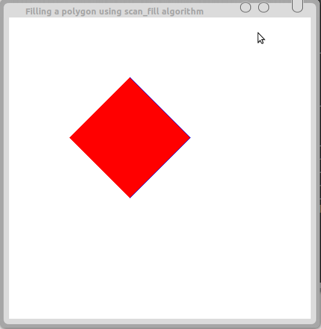

## Aim:
### Program to fill any given polygon using scan-line area filling algorithm.

## Algorithm:

For each scan line

1. Find the intersections of the scan line with all edges of the polygon.
2. Sort the intersections by increasing x-coordinate.
3. Fill in all pixels between pairs of intersections.

## Code : 
``` C
#define BLACK 0
#include<stdlib.h>
#include<stdio.h>
#include<GL/glut.h>

float x1, x2, x3, x4, y1, y2, y3, y4;

void edgedetect(float x1, float y1, float x2, float y2, int *le, int *re)
{
	float mx, x, temp;
	int i;

	/* Since we scan top to bottom, ensure that y2 lies above y1,
	 * else swap */
	if ((y2 - y1) < 0)
	{
		temp = y1; y1 = y2; y2 = temp;
		temp = x1; x1 = x2; x2 = temp;
	}

	/*
	 * 'mx' denotes the inverse of slope. For every change in y
	 * (dy), 'mx' gives us the change in x (dx). dx = dy * mx.
	 */
	if ((y2 - y1) != 0)
		mx = (x2 - x1) / (y2 - y1);
	else
		mx = x2 - x1;


	/*
	 * We start from the bottom (y1) and go up.
	 */
	x = x1;

	/*
	 * For y starting 'y1' to 'y2' mark the get the left and right
	 * edges of the Quadrilateral and assign them to 'le' and 're'
	 * respectively.
	 */
	for (i = y1; i <= y2; i++)
	{
		if (x < (float)le[i])
			le[i] = (int)x;
		if (x > (float)re[i])
			re[i] = (int)x;
		/*
		 * A change of '1' (for loop) for 'y' causes a change
		 * of 'mx' in 'x'.
		 */
		x += mx;
	}
}

/*
 * Fill the given (x, y) co-ordinate with RED color.
 */
void draw_pixel(int x, int y, int value)
{
	glColor3f(1.0, 0.0, 0.0);
	glBegin(GL_POINTS);
	glVertex2i(x, y);
	glEnd();
}

/*
 * Given the points of the Quadrilateral on the canvas, fill it with
 * color.
 */
void scanfill(float x1, float y1, float x2, float y2, float x3, float y3, float x4, float y4)
{
	/*
	 * Left_edge and right_edge denote the whole canvas, the index
	 * is up to 500 because we've set the canvas size to be 500x500
	 * in gluOrtho2D().
	 */

	int left_edge[500], right_edge[500];
	int i, j;

	for (i = 0; i < 500; i++) {
		left_edge[i] = 500;
		right_edge[i] = 0;
	}

	/*
	 * Obtain the left and right edges of the Quadrilateral by
	 * taking two points (one side) of the Quadrilateral at a
	 * time.
	 */
	edgedetect(x1, y1, x2, y2, left_edge, right_edge);
	edgedetect(x2, y2, x3, y3, left_edge, right_edge);
	edgedetect(x3, y3, x4, y4, left_edge, right_edge);
	edgedetect(x4, y4, x1, y1, left_edge, right_edge);

	/*
	 * Go through the the canvas and color each line from
	 * left_edge to right_edge
	 */
	for (j = 0;j < 500; j = j + 1) {
		if (left_edge[j] <= right_edge[j])
			for (i = (int)left_edge[j]; i < (int)right_edge[j]; i = i + 1)
				draw_pixel(i, j, BLACK);
	}
}

void display()
{
	/* Indices of the Quadrilateral. Clockwise from the bottom. */
	x1=200.0; y1=200.0;
	x2=100.0; y2=300.0;
	x3=200.0; y3=400.0;
	x4=300.0; y4=300.0;

	glClear(GL_COLOR_BUFFER_BIT);
	glColor3f(0.0, 0.0, 1.0);

	/* Draw the Quadrilateral */
	glBegin(GL_LINE_LOOP);
        glVertex2f(x1, y1);
        glVertex2f(x2, y2);
        glVertex2f(x3, y3);
        glVertex2f(x4, y4);
	glEnd();

	/* Fill the Quadrilateral */
	scanfill(x1, y1, x2, y2, x3, y3, x4, y4);

	glFlush();
}

void myinit()
{
	glClearColor(1.0, 1.0, 1.0, 1.0);
	glColor3f(1.0, 0.0, 0.0);
	glPointSize(1.0);
	glMatrixMode(GL_PROJECTION);
	glLoadIdentity();
	gluOrtho2D(0.0, 499.0, 0.0, 499.0);
}

int main(int argc, char **argv)
{
	glutInit(&argc, argv);
	glutInitDisplayMode(GLUT_SINGLE|GLUT_RGB);
	glutInitWindowSize(500, 500);
	glutInitWindowPosition(0, 0);
	glutCreateWindow("Filling a polygon using scan_fill algorithm");
	glutDisplayFunc(display);
	myinit();
	glutMainLoop();
}
```

## Output:

*Commands for execution:-*

* Open a terminal and Change directory to the file location in both the terminals.
* compile as gcc -lGLU -lGL -lglut scanfill.c -o scanfill
* If no errors, run as ./scanfill.

*Screenshots:-*


