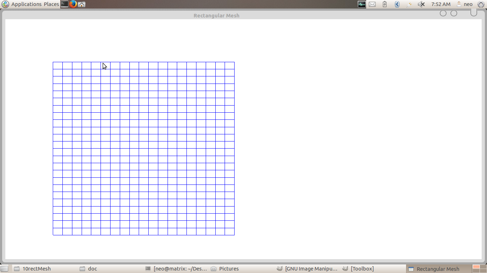

## Aim:
### Program to display a set of values {fij} as a rectangular mesh.

## Algorithm 

## Code: rectMesh.c
	#include<stdio.h>
	#include<stdlib.h>
	#include<GL/glut.h>
	#define maxx 20
	#define maxy 25
	#define dx 10
	#define dy 15
	GLfloat x[maxx]={0.0},y[maxy]={0.0};
	GLfloat x0=50,y0=50;
	GLint i,j;

	void init()
	{
		glClearColor(1.0,1.0,1.0,1.0);
		glColor3f(1.0,0.0,0.0);
		glPointSize(5.0);
		glMatrixMode(GL_PROJECTION);
		glLoadIdentity();
		gluOrtho2D(0.0,499.0,0.0,499.0);
		glutPostRedisplay();
	}

	void display(void)
	{
		glClear(GL_COLOR_BUFFER_BIT);
		//glColor3f(1.0,0.0,0.0);
		for(i=0;i<maxx;i++)
			x[i]=x0+i*dx;
		for(j=0;j<maxy;j++)
			y[j]=y0+j*dy;
		// glColor3f(0.0,0.0,1.0);
		for(i=0;i<maxx-1;i++)
			for(j=0;j<maxy-1;j++)
			{
				glColor3f(0.0,0.0,1.0);
				glBegin(GL_LINE_LOOP);
					glVertex2f(x[i],y[j]);
					glVertex2f(x[i],y[j+1]);
					glVertex2f(x[i+1],y[j+1]);
					glVertex2f(x[i+1],y[j]);
				glEnd();
				glFlush();
			}
		glFlush();
   	}

	int main(int argc,char **argv)
	{
		glutInit(&argc,argv);
		glutInitDisplayMode(GLUT_SINGLE|GLUT_RGB);
		glutInitWindowSize(500,400);
		glutInitWindowPosition(0,0);
		glutCreateWindow("Rectangular Mesh");
		glutDisplayFunc(display);
		init();
		glutMainLoop();
	}

## Output:
*Commands for execution:-*

* Open a terminal and Change directory to the file location in both the terminals.
* compile as gcc -lGLU -lGL -lglut rectMesh.c -o mesh
* If no errors, run as ./mesh

*Screenshots:-*

 	
 