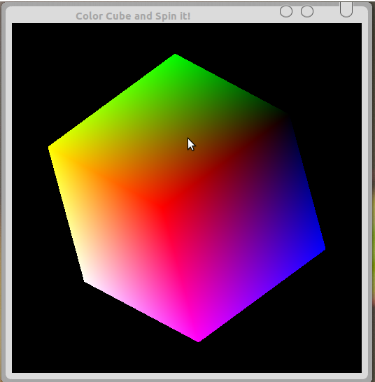

## Aim: 
### Program to draw a color cube and spin it using OpenGL transformation matrices.

## Algorithm
1. Choose eight 3 dimensional coordinate points such that will make a cube
2. Select the axis to rotate.
3. Rotate the cube by a small angle every small interval of time.
4. Repeat 3rd step as long as axis is not changed.

## Code: spinCube.c
	#include<stdlib.h>
	#include<GL/glut.h>

	GLfloat vertices [][3] = {{-1.0,-1.0,-1.0}, {1.0,-1.0,-1.0}, {1.0,1.0,-1.0}, {-1.0,1.0,-1.0}, {-1.0,-1.0,1.0}, {1.0,-1.0,1.0}, {1.0,1.0,1.0}, {-1.0,1.0,1.0}};
	GLfloat normals [][3] = {{-1.0,-1.0,-1.0}, {1.0,-1.0,-1.0}, {1.0,1.0,-1.0}, {-1.0,1.0,-1.0}, {-1.0,-1.0,1.0}, {1.0,-1.0,1.0}, {1.0,1.0,1.0}, {-1.0,1.0,1.0}};
	GLfloat colors [][3] = {{0.0,0.0,0.0}, {1.0,-1.0,-1.0}, {1.0,1.0,0.0}, {0.0,1.0,0.0}, {0.0,0.0,1.0}, {1.0,0.0,1.0}, {1.0,1.0,1.0}, {0.0,1.0,1.0}};

	void polygon(int a,int b,int c,int d)
	{
		glBegin(GL_POLYGON);
		glColor3fv(colors[a]);
		glNormal3fv(normals[a]);
		glVertex3fv(vertices[a]);
		glColor3fv(colors[b]);
		glNormal3fv(normals[b]);
		glVertex3fv(vertices[b]);
		glColor3fv(colors[c]);
		glNormal3fv(normals[c]);
		glVertex3fv(vertices[c]);
		glColor3fv(colors[d]);
		glNormal3fv(normals[d]);
		glVertex3fv(vertices[d]);
		glEnd();
	}

	void colorcube(void)
	{
		polygon(0,3,2,1);
		polygon(2,3,7,6);
		polygon(0,4,7,3);
		polygon(1,2,6,5);
		polygon(4,5,6,7);
		polygon(0,1,5,4);
	}

	static GLfloat theta[]={0.0,0.0,0.0};
	static GLint axis=2;

	void display(void)
	{
		glClear(GL_COLOR_BUFFER_BIT|GL_DEPTH_BUFFER_BIT);
		glLoadIdentity();
		glRotatef(theta[0],1.0,0.0,0.0);
		glRotatef(theta[1],0.0,1.0,0.0);
		glRotatef(theta[2],0.0,0.0,1.0);
		colorcube();
		glFlush();
		glutSwapBuffers();
	}

	void spincube()
	{
		theta[axis]+=2.0;
		if(theta[axis]>360.0)
			theta[axis]-=360;
		glutPostRedisplay();
	}
	void mouse(int btn,int state,int x,int y)
	{
		if(btn==GLUT_LEFT_BUTTON && state==GLUT_DOWN)
			axis=0;
		if(btn==GLUT_MIDDLE_BUTTON && state==GLUT_DOWN)
			axis=1;
		if(btn==GLUT_RIGHT_BUTTON && state==GLUT_DOWN)
			axis=2;
		spincube();
	}
	void myReshape(int w,int h)
	{
		glViewport(0,0,w,h);
		glMatrixMode(GL_PROJECTION);
		glLoadIdentity();
		if(w<=h)
			glOrtho(-2.0,2.0,-2.0*(GLfloat) h/(GLfloat) w, 2.0*(GLfloat) h/(GLfloat)w, -10.0,10.0);
		else
			glOrtho(-2.0*(GLfloat) w/(GLfloat) h, 2.0*(GLfloat) w/(GLfloat) h, -2.0,2.0,-10.0,10.0);
		glMatrixMode(GL_MODELVIEW);
	}
	int main(int argc,char **argv)
	{
		glutInit(&argc,argv);
		glutInitDisplayMode(GLUT_DOUBLE|GLUT_RGB|GLUT_DEPTH);
		glutInitWindowSize(500,500);
		glutCreateWindow("Color Cube and Spin it! ");
		glutReshapeFunc(myReshape);
		glutDisplayFunc(display);
		glutIdleFunc(spincube);
		glutMouseFunc(mouse);
		glEnable(GL_DEPTH_TEST);
		glutMainLoop();
	}

## Output:
*Commands for execution:-*

* Open a terminal and Change directory to the file location in both the terminals.
* compile as gcc -lGLU -lGL -lglut spinCube.c -o spincube
* If no errors, run as ./spincube

*Screenshots:-*

 	