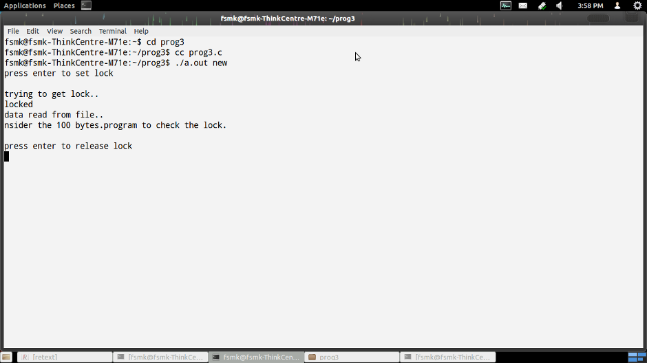
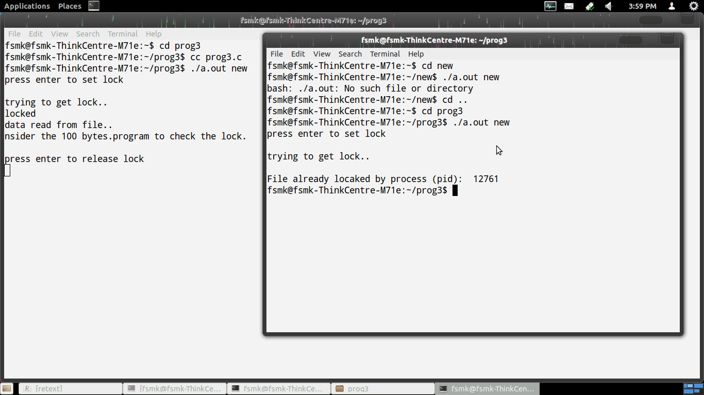
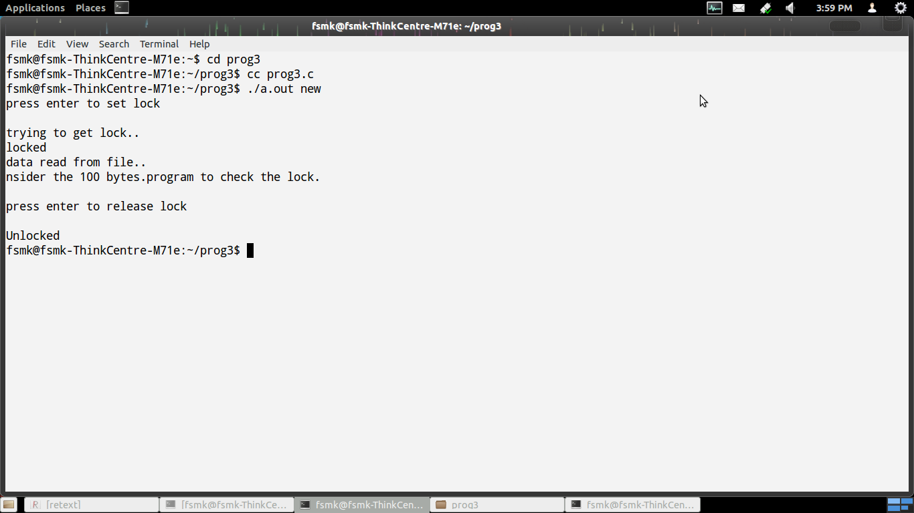

## Aim:

### Consider the last 100 bytes as a region. Write a C/C++ program to check whether the region is locked or not. If the region is locked, print pid of the process which has locked. Ifthe region is not locked, lock the region with an exclusive lock, read the last 50 bytes and unlock the region.

## Theory:

File locking provides a very simple yet incredibly useful mechanism for coordinating file accesses.

flock - manage locks from shell scripts.

fcntl(used to manipulate the file descriptors) file commands can be used to support record locking, which permits multiple cooperating programs to prevent each other from simultaneously accessing parts of a file in error-prone ways.

fcntl() performs the operations on the open file descriptor fd.

F_GETLK, F_SETLK and F_SETLKW are used  to  acquire, release, and test for the existence of record locks.F_UNLK to remove the existing lock.

## Code:

<pre><code> #include &lt;stdio.h&gt;
 #include &lt;stdlib.h&gt;
 #include &lt;unistd.h&gt;
 #include &lt;fcntl.h&gt;
 #include &lt;errno.h&gt;
 int main(int argc,char *argv[])
 {
        int fd;
        char buffer[255];
        struct flock fvar;
        if(argc==1)
        {
                printf("usage: %s filename\n",argv[0]);
                return -1;
        }
        if((fd=open(argv[1],O_RDWR))==-1)
        {
                perror("open");
                exit(1);
        }
        fvar.l_type=F_WRLCK;
        fvar.l_whence=SEEK_END;
        fvar.l_start=SEEK_END-100;
        fvar.l_len=100;
        printf("press enter to set lock\n");
        getchar();
        printf("trying to get lock..\n");
        if((fcntl(fd,F_SETLK,&fvar))==-1)
        {     fcntl(fd,F_GETLK,&fvar);
              printf("\nFile already locked by process (pid):    \t%d\n",fvar.l_pid);        
              return -1;        
        }
        printf("locked\n");
        if((lseek(fd,SEEK_END-50,SEEK_END))==-1)
        {
                perror("lseek");
                exit(1);
        }
        if((read(fd,buffer,100))==-1)
        {
                perror("read");
                exit(1);
        }
        printf("data read from file..\n");
        puts(buffer);
        printf("press enter to release lock\n");
        getchar();
        fvar.l_type = F_UNLCK;
        fvar.l_whence = SEEK_SET;
        fvar.l_start = 0;
        fvar.l_len = 0;
        if((fcntl(fd,F_UNLCK,&fvar))==-1)
        {
                perror("fcntl");
                exit(0);
        }
        printf("Unlocked\n");
        close(fd);
        return 0;
 }</code></pre>

## Output:

*Commands for instructions:*
<ol>
	<li> Compile the program </li>
	<li> Run the program using ./a.out filename </li>
	<li>	Note: Do not stop execution </li>
	<li> Open another terminal </li>
	<li> Run the program using ./a.out filename </li>
		Note: Both the filename's should be same </li>
</ol>

## Screenshots:

