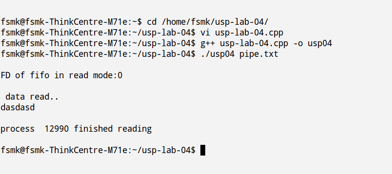

##Aim:
Write a C/C++ program which demonstrates interprocess communication between a reader process and a writer process. Use mkfifo, open, read, write and close APIs in your program.

##Algorithm:

##Theory:

<blockquote>

Pipes are the oldest form of UNIX System IPC and are provided by all UNIX systems. Pipes have two
limitations.

<blockquote>

<ol>
<li>
Historically, they have been half duplex (i.e., data flows in only one direction). Some systems
now provide full-duplex pipes, but for maximum portability, we should never assume that this is
the case.</li>
<li>
Pipes can be used only between processes that have a common ancestor. Normally, a pipe is
created by a process, that process calls fork, and the pipe is used between the parent and the
child.
</li>
</ol>

</blockquote>

A pipe is created by calling the pipe function.

<blockquote>

<pre>
#include &lt;unistd.h&gt;
int pipe(int filedes[2]);
</pre>

</blockquote>

Returns: 0 if OK, 1 on error

Figure "Pipe from parent to child"

 

For a pipe from the child to the parent, the parent closes fd[1], and the child closes fd[0]. When one end of a pipe is closed, the following two rules apply.
<ol>
<li>If we read from a pipe whose write end has been closed, read returns 0 to indicate an end of file
after all the data has been read. (Technically, we should say that this end of file is not
generated until there are no more writers for the pipe. It's possible to duplicate a pipe
descriptor so that multiple processes have the pipe open for writing. Normally, however, there is
a single reader and a single writer for a pipe. When we get to FIFOs in the next section, we'll
see that often there are multiple writers for a single FIFO.)</li>
<li>If we write to a pipe whose read end has been closed, the signal SIGPIPE is generated. If we
either ignore the signal or catch it and return from the signal handler, write returns 1 with
errno set to EPIPE.</li></ol>

When we're writing to a pipe (or FIFO), the constant PIPE_BUF specifies the kernel's pipe buffer size.
A write of PIPE_BUF bytes or less will not be interleaved with the writes from other processes to the
same pipe (or FIFO). But if multiple processes are writing to a pipe (or FIFO), and if we write more
than PIPE_BUF bytes, the data might be interleaved with the data from the other writers. We can
determine the value of PIPE_BUF by using pathconf or fpathconf.</pre>
</blockquote>

##Code:

<pre><code>#include&lt;stdio.h&gt;
#include&lt;stdlib.h&gt;
#include&lt;iostream&gt;
#include&lt;unistd.h&gt;
#include&lt;limits.h&gt;
#include&lt;fcntl.h&gt;
using namespace std;
#define BUFFER_SIZE PIPE_BUF
int main(int argc,char *argv[])
{
        int pipe_fd,res=0;
        char buffer[BUFFER_SIZE+1];
        if(argc!=2)
        {
                cout&lt;&lt;"usage:./a.out pipe_name\n";
                return -1;
        }
        cout&lt;&lt;"\nFD of fifo in read mode:"&lt;&lt;pipe_fd&lt;&lt;endl;
        if((pipe_fd=open(argv[1],O_RDONLY))!=-1)
        {
                res=read(pipe_fd,buffer,BUFFER_SIZE);
                cout&lt;&lt;"\n data read..\n";
                cout&lt;&lt;buffer;
                (void) close(pipe_fd);
        }
        else
        {
                perror("\nfifo read\n");
        }
        cout&lt;&lt;\nprocess  "&lt;&lt;getpid()&lt;&lt;" finished reading\n"&lt;&lt;endl;
        return 0;
}
</code></pre>

##Output:

*Commands for execution:-*
<ul>
    <li> Open a terminal.</li>
    <li> Change directory to the file location in the terminal.</li>
    <li> Run gcc "usp01.c -o usp04.out" in the terminal.</li>
    <li> If no errors, run "./usp04.out pipe1" </li>
</ul>

##Screenshots:

  