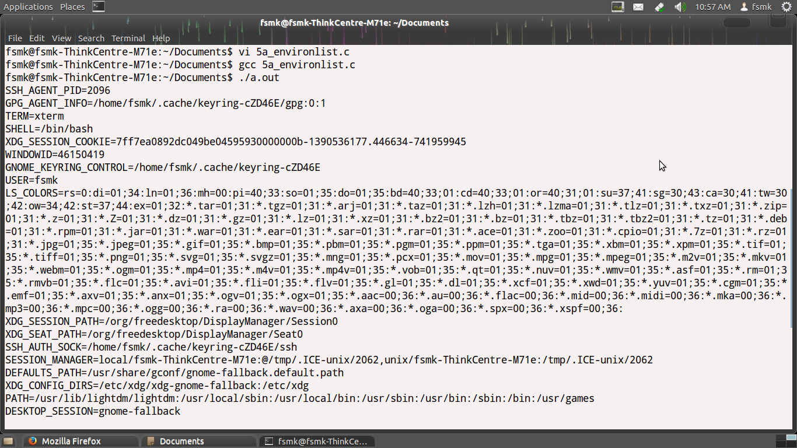
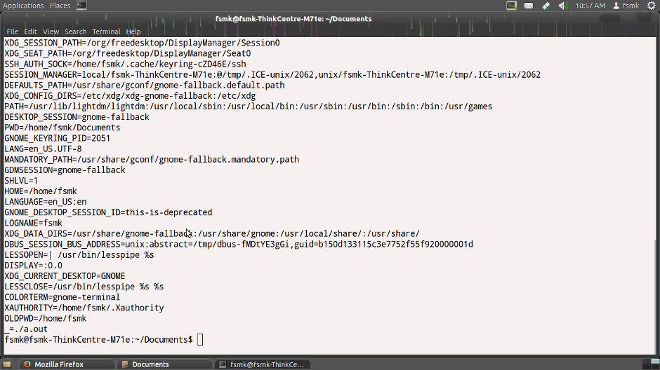

##Aim :

###Write a C/C++ program thgat output the contents of its Environment list.

##Theory :

>Environment variables are a set of dynamic named values that can affect the way running processes will behave on a computer.

>They are part of the operating environment in which a process runs. For example, a running process can query the value of the TEMP environment variable to discover a suitable location to store temporary files, or the HOME or USERPROFILE variable to find the directory structure owned by the user running the process.

##Code :

<pre><code>
 #include&lt;stdio.h&gt;
 #include&lt;unistd.h&gt;
 int main(int argc,char *argv[])
 {
  int i;
  char **ptr;
  extern char **environ;
  for(ptr=environ; *ptr; ptr++)
   printf("%s\n",*ptr);
  return 0;
 }
</code></pre>

##Output:
<ul>
<li>Open a terminal.</li>
<li>Change directory to the file location in both the terminals.</li>
 <li>Open a file using command followed by program_name <pre>vi 5a_environlist.c </pre> and then enter the source code and save it.</li>
 <li>Then compile the program using <pre>gcc 5a_environlist.c</pre></li>
 <li>If there are no errors after compilation execute the program using <pre>./a.out </pre></li>
</ul>

##Screenshot :

