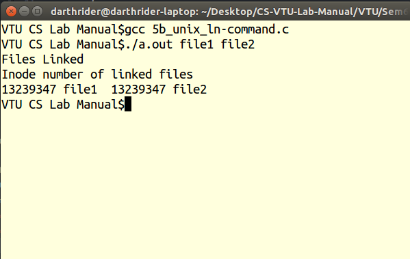

##Aim :

###Write a C / C++ program to emulate the unix ln command.

##Theory :

>Links are created by giving alternate names to the original file. The use of links allows a large file, such as a database or mailing list, to be shared by several users without making copies of that file.
>Not only do links save disk space, but changes made to one file are automatically reflected in all the linked files.
>The ln command links the file designated in the SourceFile parameter to the file designated by the TargetFile parameter or to the same file name in another directory specified by the TargetDirectory parameter. By default, the ln command creates hard links.

>To create a link to a file named chap1, type the following:

>><pre>ln -f chap1 intro</pre>

>This links chap1 to the new name, intro. When the -f flag is used, the file name intro is created if it does not already exist. If intro does exist, the file is replaced by a link to chap1. Both the chap1 and intro file names refer to the same file.

>To link a file named index to the same name in another directory named manual, type the following:

>><pre>ln index manual</pre>

>This links index to the new name, manual/index.
To link several files to names in another directory, type the following:

>><pre>ln chap2 jim/chap3 /home/manual </pre>

>This links chap2 to the new name /home/manual/chap2 and jim/chap3 to /home/manual/chap3.

##Code :

<pre><code>
 #include&lt;stdio.h&gt;
 #include&lt;unistd.h&gt;
 int main(int argc, char *argv[])
 {
  if(argc!=3)
   {
     printf("Usage: %s &lt;src_file&gt;&lt;dest_file&gt;\n",argv[0]);
     return 0;
   }
  if(link(argv[1],argv[2])==-1)
  {
   printf("Link Error\n");
   return 1;
  }
  printf("Files Linked\n")
  char str[100];
  sprintf(str,"ls -li %s %s\n",argv[1],argv[2]);
  system(str);
  return 0;
 }
</code></pre>

##Output :

<ul>
<li>Open a terminal.</li>
<li>Change directory to the file location in both the terminals.</li>
 <li>Open a file using command followed by program_name <pre>vi 5b_unix_ln-command.c </pre> and then enter the source code and save it.</li>
 <li>Then compile the program using <pre>g++ 5b_unix_ln-command.c</pre></li>
<li>Then create a dummy file with any of the name like abc.c .</li>
 <li>If there are no errors after compilation execute the program using <pre>./a.out abc.c out.c</pre>where abc.c is the source file and out.c is the new destination file to be given.</li>
 <li> The inode number for both files are displayed by executing ls -li command using system API  and is verified to be the same</li>
</ul>

##Screenshot :

