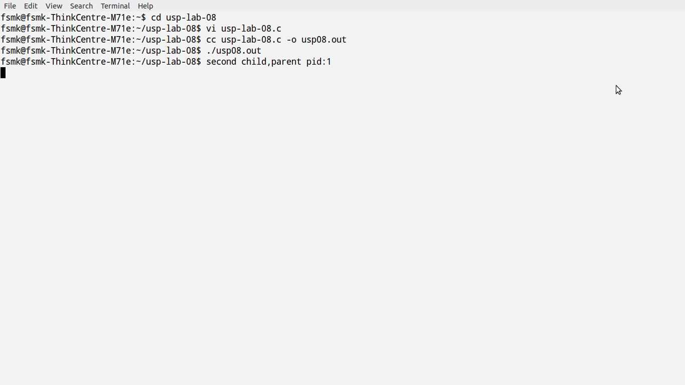

## Aim:

###W rite a C/C++ program to avoid zombie process by forking twice.

## Algorithm:

## Theory:

<blockquote>

If we want to write a process so that it
forks a child but we don't want to wait for the child to complete and we don't want the child to
become a zombie until we terminate, the trick is to call fork twice.

We call sleep in the second child to ensure that the first child terminates before printing the parent process ID. After a fork, either the parent or the child can continue executing; we never know which will resume execution first. If we didn't put the second child to sleep, and if it resumed execution after the fork before its parent, the parent process ID that it printed would be that of its parent, not process ID 1.

</blockquote>

## Code:

<pre><code>#include &lt;stdio.h&gt;
#include &lt;stdlib.h&gt;
#include &lt;unistd.h&gt;

int main()
{
	int pid;
	pid = fork();

	if (pid == 0) {
		// First child
		pid = fork();
		if (pid == 0) {
			// Second child
			sleep(1);
			printf("Second child: My parent PID is %d\n", getppid());
		}
	}
	else {
		// Parent process
		wait(NULL);
		sleep(2);
		system("ps -o pid,ppid,state,tty,command");
	}
	return 0;
}
</code></pre>

## Output:

*Commands for execution:-*
<ul>
    <li> Open a terminal.</li>
    <li> Change directory to the file location in the terminal.</li>
    <li> Run "gcc usp06.c -o usp08.out" in the terminal.</li>
    <li> If no errors, run "./usp08.out"</li>
</ul>

## Screenshot

