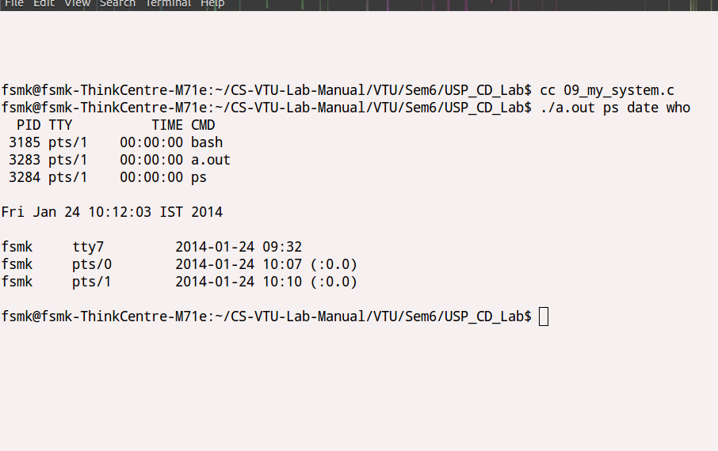

##Aim:

###Write a C/C++ program to implement the system function.

##Theory:
>fork()  creates  a new process by duplicating the calling process.  The
new process, referred to as the child, is an  exact  duplicate  of  the calling  process,  referred  to as the parent.

>system()  executes a command specified in command by calling   /bin/sh -c command, and returns after the command has been completed.
The  exec() family of functions replaces the current process image with
       a new process image. 
>The execl() function is one among the exec() family of functions.
>The  waitpid()  system  call  suspends execution of the calling process until a child specified by pid argument has changed state.

##Code:

	#include<stdio.h>
	#include<stdlib.h>
	#include<unistd.h>
	#include<errno.h>
	#include<sys/types.h>
	#include<sys/wait.h>
	void sys(const char *cmdstr)
	{
		int pid;
		pid=fork();
		if(pid==0)
		        execl("/bin/bash","bash","-c",cmdstr,NULL);
		else
		waitpid(pid,NULL,0);
	}
	int main(int argc,char *argv[])
	{
		int i;
		for(i=1;i< argc;i++)
		{        sys(argv[i]);
		        printf("\n");
		}
		_exit(0);
	}

##Output:
<ul>
<li>Open a terminal</li>
<li>Change the present working directory to the location where the program exists using the cd command in the terminal</li>
<li>Complile the program using the command cc <em>&lt;program name&gt;</em> -o usp09.out</li>
<li>run the program using ./usp09.out</li>
Note:To run use ./a.out command1 command2 ,..., commandn where each command is a shell command. Example : ./a.out ps date who 
###Screenshot:

