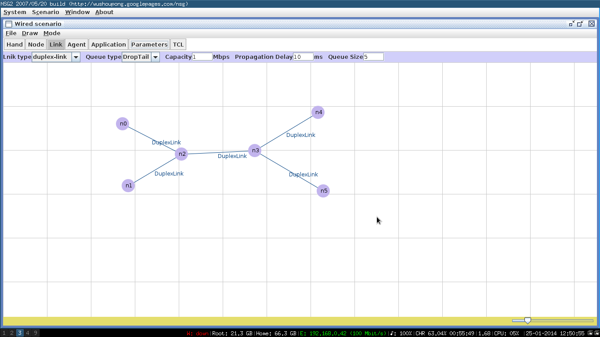

## Aim:
## Simulate the transmission of ping messages over a network topology consisting of 6 nodes and find the number of packets dropped due to congestion. 

## Description:

> Ping sends ICMP ECHO_REQUEST to network hosts. Ping uses the ICMP  protocol's  mandatory  ECHO_REQUEST  datagram  to elicit  an  ICMP  ECHO_RESPONSE from a host or gateway.  ECHO_REQUEST datagrams ("pings") have an IP  and  ICMP  header, followed  by a struct  timeval and then an arbitrary number of ``pad'' bytes used to fill out the packet.

## Packages required to be pre-installed:

* (if they dont already exist)
* openjdk6-jre-headless or openjdk7-jre-headless
* nam
* ns2

## Instructions to Simulate:
1. Open ns2g2.jar by right clicking on the jar file and choosing open with java. Ns2g2.jar file is java dependent.
2. On the editing panel, choose **Scenario**, and select **Wired Scenario**.
3. The **node** tab is to be selected next to place the nodes on the grid. This program requires the user to have 6 nodes in the network. Draw 6 nodes on the network.
4. The **link** tab provides the user to link the nodes in the grid. Connect all the nodes. Select **Link type** as **duplex**(bi-directional link), **Queue** type as **Droptail**(indication stating the packets are to be dropped at destination only), **capacity** as **1Mbps**, **propagation delay** as **10ms** and **queue size** as desirable(i.e 5, 10, etc.)
5. After finishing the topology, click on **TCL** tab. It generates the code and save it where required as a .tcl file.
6. After saving, open the file in a text editor.(like nano, gedit, vi etc)
7. Now enter the following code under the agent definition header:	
<code>	
	//creating an agent object  
	set ping0 [new Agent/Ping]  
	//agent object node0 	
	$ns attach-agent $n0 $ping0 
	set ping1 [new Agent/Ping] 
	//agent object node1 
	$ns attach-agent $n1 $ping1
	set ping4 [new Agent/Ping] 
	//agent object node4 
	$ns attach-agent $n4 $ping4
	set ping5 [new Agent/Ping] 
	//agent object node5 
	$ns attach-agent $n5 $ping5
	//node2 and node3 acts as an intermediate nodes 
	//$ns connect $source $destination 
	$ns connect $ping0 $ping4  
	$ns connect $ping1 $ping5  
	//function to constantly ping th destination at an interval of 0.01s 
	proc sendPingPacket {} { 
		//global objects 
		global ns ping0 ping1
		//time interval 
		set time 0.01
		//sets now with the current time of simulation 
		set now [$ns now] 
		//when the current simulation time($now) + time($time = 0.01) occurs a ping is sent to the destination 
		$ns at [expr $now + $time] "$ping0 send" 
		$ns at [expr $now + $time] "$ping1 send" 
		//pingPacket is sent 
		$ns at [expr $now + $time] "sendPingPacket" 
	} 
	//In the Tcl code, a procedure 'Agent/Ping recv {from rtt}' has to be defined which allows the user to react to the ping result. 
   	Agent/Ping instproc recv {from rtt} { 
		global seq 
		$self instvar node_ 
	} 
	$ns at 0.01 "sendPingPacket" 
	$ns at 10.0 "finish" 

8. Save the file.
9. To run it on terminal, tpye the command, `ns *filename.tcl*`
10. When the code compiles successfully, the Network Animator(nam) will automatically open for the simulation.
11. In nam, click on the play button and simulation will be run.
12. Once the simulation ends, in the terminal, type `cat out.tr | grep ^d | wc -l` to know the number of packets dropped.
13. Multiple scenarios can be generated by changing the values of bandwidth and queue size of the links in the ns2.

## Screenshots:-

	