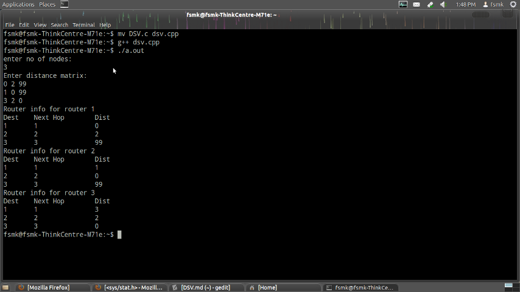

## Aim: 
### Write a program for distance vector algorithm to find suitable path for transmission.

## Theory
> Routing algorithm is a part of network layer software which is responsible for deciding which
output line an incoming packet should be transmitted on. If the subnet uses datagram internally, this
decision must be made anew for every arriving data packet since the best route may have changed
since last time. If the subnet uses virtual circuits internally, routing decisions are made only when a
new established route is being set up. The latter case is sometimes called session routing, because a
rout remains in force for an entire user session (e.g., login session at a terminal or a file).

> Routing algorithms can be grouped into two major classes: adaptive and non-adaptive.
Nonadaptive algorithms do not base their routing decisions on measurement or estimates of current
traffic and topology. Instead, the choice of route to use to get from I to J (for all I and J) is compute in
advance, offline, and downloaded to the routers when the network ids booted. This procedure is
sometime called static routing.

> Adaptive algorithms, in contrast, change their routing decisions to reflect changes in the
topology, and usually the traffic as well. Adaptive algorithms differ in where they get information
(e.g., locally, from adjacent routers, or from all routers), when they change the routes, and what metric is used for
optimization (e.g., distance, number of hops, or estimated transit time).

> Two algorithms in particular, distance vector routing and link state routing are the most popular.
Distance vector routing algorithms operate by having each router maintain a table (i.e., vector)
giving the best known distance to each destination and which line to get there. These tables are
updated by exchanging information with the neighbour's.
> The distance vector routing algorithm is sometimes called by other names, including the
distributed Bellman-Ford routing algorithm and the Ford-Fulkerson algorithm, after the researchers
who developed it (Bellman, 1957; and Ford and Fulkerson, 1962). It was the original ARPANET
routing algorithm and was also used in the Internet under the RIP and in early versions of DEC net
and Novell'Ps IPX. AppleTalk and Cisco routers use improved distance vector protocols.

> In distance vector routing, each router maintains a routing table indexed by, and containing one
entry for, each router in subnet. This entry contains two parts: the preferred outgoing line to use for
that destination, and an estimate of the time or distance to that destination. The metric used might
be number of hops, time delay in milliseconds, total number of packets queued along the path, or
something similar.

> The router is assumed to know the "distance" to each of its neighbour. If the metric is hops, the
distance is just one hop. If the metric is queue length, the router simply examines each queue. If the
metric is delay, the router can measure it directly with special ECHO packets that the receiver just
time stamps and sends back as fast as possible.

## Algorithm:
1. Start
2. By convention, the distance of the node to itself is assigned to zero and when a node is unreachable the distance is accepted as 999.
3. Accept the input distance matrix from the user (*dm[][]*) that represents the distance between each node in the network.
4. Store the distance between nodes in a suitable varible.
5. Calculate the minimum distance between two nodes by iterating.
    * If the distance between two nodes is larger than the calculated alternate available path, replace the existing distance with the calculated distaance.
6. Print the shortest path calculated.
7. Stop.

## Code: filename.cpp

```cpp
#include <iostream>
#include <stdio.h>

using namespace std;

struct node {
	int dist[20];
	int from[20];
} route[10];

int main()
{
	int dm[20][20], no;

	cout << "Enter no of nodes." << endl;
	cin >> no;
	cout << "Enter the distance matrix:" << endl;
	for (int i = 0; i < no; i++) {
		for (int j = 0; j < no; j++) {
			cin >> dm[i][j];
			/*  Set distance from i to i as 0 */
			dm[i][i] = 0;
			route[i].dist[j] = dm[i][j];
			route[i].from[j] = j;
		}
	}

	int flag;
	do {
		flag = 0;
		for (int i = 0; i < no; i++) {
			for (int j = 0; j < no; j++) {
				for (int k = 0; k < no; k++) {
					if ((route[i].dist[j]) > (route[i].dist[k] + route[k].dist[j])) {
						route[i].dist[j] = route[i].dist[k] + route[k].dist[j];
						route[i].from[j] = k;
						flag = 1;
					}
				}
			}
		}
	} while (flag);

	for (int i = 0; i < no; i++) {
		cout << "Router info for router: " << i + 1 << endl;
		cout << "Dest\tNext Hop\tDist" << endl;
		for (int j = 0; j < no; j++)
			printf("%d\t%d\t\t%d\n", j+1, route[i].from[j]+1, route[i].dist[j]);
	}
	return 0;
}
```

## Output:
*Commands for execution:-*

* Open a terminal.
* Change directory to the file location.
* Run g++ *filename.cpp* 
* If there are no errors, run ./a.out

*Screenshots:-*


