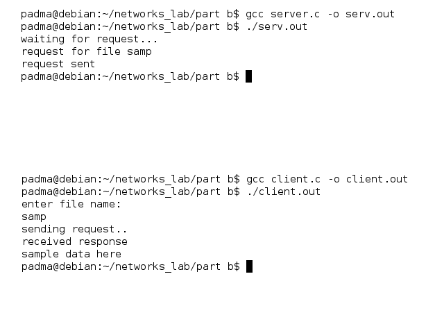

## Aim: 
### Using TCP/IP sockets, write a client-server program to make client sending the file name and the server to send back the contents of the requested file if present.

## Theory
> This  is  an  implementation of the TCP protocol. It provides a reliable, stream-oriented, full-duplex connection between two sockets on top of IP, for both v4 and v6 versions.  TCP  guarantees  that  the  data arrives in order and retransmits lost packets.  It generates and checks a per-packet checksum to catch transmission errors.  TCP does not preserve record boundaries.

> A newly created TCP socket has no remote or local address and is not fully specified.  To create an  outgoing  TCP  connection  use  connect to  establish  a  connection  to  another  TCP socket.  To receive new incoming connections, first bind the socket to a local address and port and then call listen to put the socket into the listening state.  After that a new socket for each  incoming  connection  can  be  accepted using accept.  A socket which has had accept or connect successfully called on it is fully specified and may transmit data.  Data cannot be transmitted on listening or not yet connected sockets.

## Algorithm: Client Side
1. Start.
2. Create a socket using socket() system call.
3. Connect the socket to the address of the server using connect() system call.
4. Send the filename of required file using send() system call.
5. Read the contents of the file sent by server by recv() system call.
6. Stop.

## Algorithm: Server Side
1. Start.
2. Create a socket using socket() system call.
3. Bind the socket to an address using bind() system call.
4. Listen to the connection using listen() system call.
5. accept connection using accept()
6. Receive filename and transfer contents of file with client.
7. Stop.

## Code: client.c
```c
#include <stdio.h>
#include <arpa/inet.h>
#include <fcntl.h>
#include <unistd.h>

int main()
{
	int soc, n;
	char buffer[1024], fname[50];
	struct sockaddr_in addr;

	/*  socket creates an endpoint for communication and returns a file descriptor */
	soc = socket(PF_INET, SOCK_STREAM, 0);

	/*
	 * sockaddr_in is used for ip manipulation
	 * we define the port and IP for the connection.
	 */
	addr.sin_family = AF_INET;
	addr.sin_port = htons(7891);
	addr.sin_addr.s_addr = inet_addr("127.0.0.1");

	/*  keep trying to esatablish connection with server */
	while(connect(soc, (struct sockaddr *) &addr, sizeof(addr))) ;

	printf("enter file name: ");
	scanf("%s", fname);
	/*  send the filename to the server */
	send(soc, fname, sizeof(fname), 0);

	printf("recieved response\n");
	/*  keep printing any data received from the server */
	while ((n = recv(soc, buffer, sizeof(buffer), 0)) > 0)
		write(1, buffer, n);

	return 0;
}
```

## Code: server.c
```c
#include <stdio.h>
#include <arpa/inet.h>
#include <fcntl.h>
#include <unistd.h>

int main()
{
	int welcome, new_soc, fd, n;
	char buffer[1024], fname[50];
	struct sockaddr_in addr;

	welcome = socket(PF_INET, SOCK_STREAM, 0);

	addr.sin_family = AF_INET;
	addr.sin_port = htons(7891);
	addr.sin_addr.s_addr = inet_addr("127.0.0.1");

	bind(welcome, (struct sockaddr *) &addr, sizeof(addr));
	/*  listen for connections from the socket */
	listen(welcome, 5);
	/*  accept a connection, we get a file descriptor */
	new_soc = accept(welcome, NULL, NULL);

	/*  receive the filename */
	recv(new_soc, fname, 50, 0);
	printf("Requesting for file: %s\n", fname);

	/*  open the file and send its contents */
	fd = open(fname, O_RDONLY);

	if (fd < 0)
		send(new_soc, "file not found\n", 15, 0);
	else
		while ((n = read(fd, buffer, sizeof(buffer))) > 0)
			send(new_soc, buffer, n, 0);
	printf("request sent\n");
	close(fd);

	return 0;
}

```


## Output:
*Commands for execution:-*

* Open two terminals one for client and  server each.
* Change directory to the file location in both the terminals.
* Run gcc *server.c* -o serv.out in the server terminal.
* If no errors, run ./serv.out
* Run gcc *client.c* -o client.out in the client terminal.
* If no errors, run ./client.out

*Screenshots:-*


