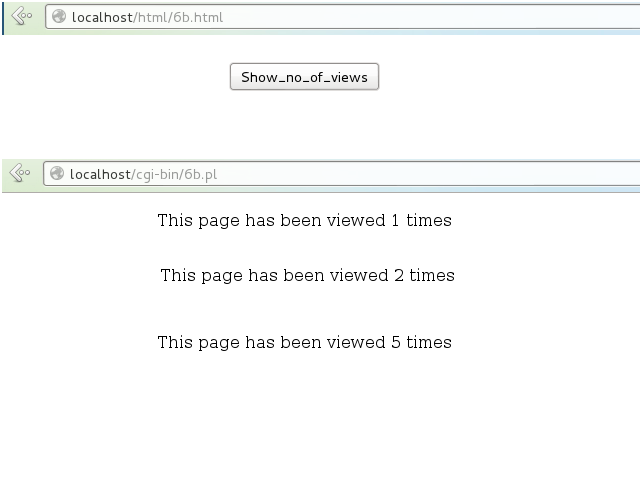

# Program 6:
## a) Write a Perl program to accept the User Name and display a greeting message randomly chosen from a list of 4 greeting messages.
## b) Write a Perl program to keep track of the number of visitors visitingthe web page and to display this count of visitors, with proper headings.
***

### Tags used:
     open() - opens a file if existing otherwise creates a new one. 
     '<filename' is opened for input 
     '<filename' is opened for output starting at the beginning of the file

### Code: 
*6a.html*

     <html>
          <!-- path to perl file -->
          <form action="http://localhost/cgi-bin/6a.pl">
               

                    <!-- input -->
                    <h2>Enter your name:</h2>
                    <input type=text name=name />
                    <input type=submit value=submit />
               

          </form>
     </html>     

*6a.pl*

     #!/usr/bin/perl
     #load CGI standard routines
     use CGI':standard';
     #take input and store in local variable
     $cmd=param('name');
     #define various greeting messages
     @greet=("Hello","Hai","Nice meeting you","Have a nice day");
     #choose a message based on the length of the input
     $index=int rand scalar @greet;
     print<<here;
     Content-type:text/html\n\n
     <html>
         

              <h2>$cmd, $greet[$index]</h2>
         

     </html>
     here
     
### Output:
*Steps for checking output-*

* Save the .html file in the folder `/var/www/html`
* Save the .pl files in the folder `/var/www/cgi-bin`
* Change the file permission of the perl file by running the command `sudo chmod 777 6a.pl`
* Open a browser and in the address bar type `localhost/html/6a.html`
* Enter input to view the greeting message.

### Screenshots:

### Code:
*6b.html*

     <html>
          <form action="http://localhost/cgi-bin/6b.pl">
               

                    <input type=submit value=Show_no_of_views />
               

          </form>
     </html>

*6b.pl*

     #!/usr/bin/perl
     #load CGI standard routines
     use CGI':standard';
     print "Content-type:text/html\n\n";
     #open a file called count.txt to store values of number of views
     open(FILE,'<count.txt');
          #contents of file are copied to the variable
          $count=<FILE>;
     close(FILE);
     $count++;
     #append the new incremented value to the beginning of the file
     open(FILE,'>count.txt');
          print FILE "$count";
     print "This page has been viewed $count times";

### Output:
*Steps for checking output-*

* Save the .html file in the folder `/var/www/html`
* Save the .pl files in the folder `/var/www/cgi-bin`
* Change the file permission of the perl file by running the command `sudo chmod 777 6b.pl`
* Open a `terminal`. Change directory by `cd /var/www/cgi-bin` and then run the command `touch count.txt`. This initializes an empty file to store page views.
* Run the command `sudo chmod 777 count.txt` in order to continuously update the file on every view to the browser page.
* Open a browser and in the address bar type `localhost/html/6b.html`
* By clicking `Show_no_of_views`, the number of views to the browser page is displayed and on every refresh, the value gets incremented.

### Screenshots:

