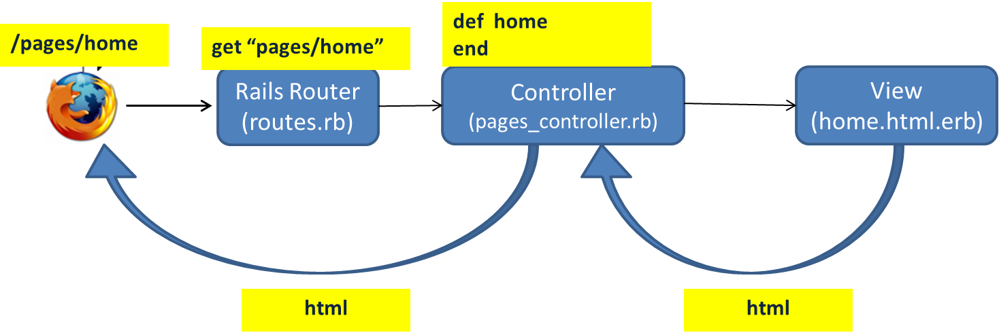
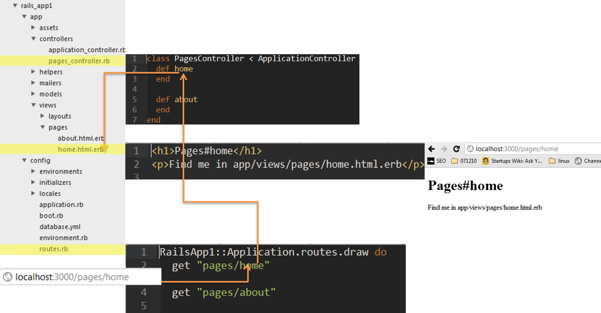
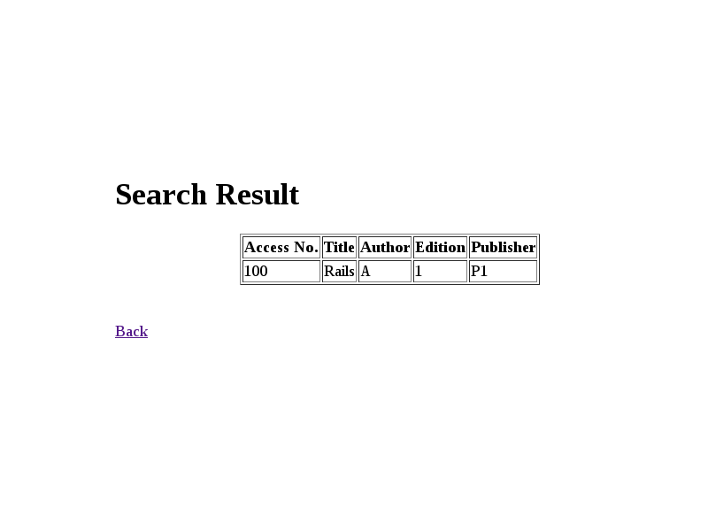

## Program 12: 
### Build a Rails application to accept book information viz. Accession number, title, authors, edition and publisher from a web page and store the information in a database and to search for a book with the title specified by the user and to display the search results with proper headings.
***

### Procedure for execution:

* Open a terminal and run `mkdir rails_app && cd $_` 
* Create a new app called books using the command `rails new books -d mysql`
* Run the command `cd books/config` and open the database.yml file to set mysql username and password by running the command `nano database.yml`. The *username* and *password* are required to be filled at 3 sections in the file.
* The following is a sample snippet from the database.yml file-

     adapter: mysql2  
     encoding: utf8  
     reconnect: false  
     database: books_development  
     pool: 5
     username: root  
     password: pass  
     socket: /var/run/mysqld/mysqld.sock

* Save the file by `ctrl+x` and then `y`.
* Now run `cd ..` and make sure that you are present in the `rails_app/books` directory.
* Run the command `rake db:create`
* Next, run `rails generate controller books index`
* Next, run `rails generate model book access_no:integer title:string author:string edition:integer
publisher:string`
* Run `rake db:migrate`
* Now, `cd app/views/books` and edit the file `nano index.html.erb` - 
     
* Also, edit the file `nano search.html.erb`
* Now, `cd ../../controllers` and edit the file `nano books_controller.rb`
* Next, run `cd ../../config` and edit `nano routes.rb` file.
* Finally, run `cd ..` and start the rails server by running the command `rails s`
* Open a browser and in the address bar type `localhost:3000` to check if the rails server is running. If yes, add to the URL, `localhost:3000/books/index`.
* Enter the input & on successfully inserting data, search for the same from the browser. The output is displayed in a table on the browser.

###Explaination

* The rails new command has created a Rails application in a new directory called books
* The -d options in the rails new command allows us to specify which DBMS to use. The default is sqlite. However we use mysql 
* The database.yml file has all the cofiguration information which allows our application to connect, create and modify the database
* You run rake db:create once and only once, and you run it first. Then you run rake db:migrate every time you add/change a migration
* The rails generate controller command created a lot of files and directories. We are interested in two of them for now :-
    * app/controllers/books_controller.rb
    * app/views/books/index.html.erb
* Inside Rails application, the controller file is placed inside app/controllers directory
* ####The Controller 
    * User types a URL, lets say http://localhost:3000/pages/home. If the Rails server is running, the request first reaches the Rails router.
    * 
    
    * The Router checks the config/routes.rb file to see if there is an entry matching the URL requested. In our case there is a route entry - get "pages/home". In short, the route matches incoming URL `/pages/home` to home action in Pages controller. So the request is forwarded to the Pages controller, home action.
    
    * 
 

    * In our program the BooksController is a class. Intially there is an empty method index inside the class. The method is also called index action in the Books controller.
    
                class BooksController < ApplicationController
    
                def index
    
                end

    * This action serves the url /books/index when accessed. Even though the index action is an empty method, it fetches the file /apps/views/books/index.html.erb and displays it on the browser.
    
* ####The Model
    * Rails interact with the database through models. In our program we have a model called Book. This ensures that the our model is independent of the DBMS
    * When you create a model, the name is singular and the name starts with capital letter. Book, instead of Books
    * In our model we have the following attributes
    
        * access_no:integer
        * title:string
        * author:string
        * edition:integer
        * publisher:string
        
    * The `rails generate model` command also creates a migration file present under db/migrate
    * The migration file is like schema which defines the database table structure
    * rake db:migrate pushes the database changes from the migration file to the actual database
    * If you end up doing a mistake you can always undo the creation of a model using
           
                   rails destroy model Book
                 
    * If you want to delete the database from the DBMS once the model has been migrated use 
                    
                    rake db:rollback
* ####Ruby Tags
* RoR has the following 2 tags :
    * <% %> : The output of this tag will NOT be displayed on the browser
    * <%= %> : The output will be displayed on the browser   
###Code:
* **index.html.erb**

    &lt;h1>Books&#60;/h1> 
    &lt;h3 style="text-align: center;">Add a book&lt;/h3> 
    <%= form_tag("/books/add", :method=>"post") do %>  
    //creates a form tag in html i.e   
    &lt;form action="/books/add" method="post">   
    Access No:<%= text_field_tag(:b_access_no) %>      
    //creates a input tag whose type is text and id is :b_access_no i.e   
    &lt;input type="text" id=":b_access_no"> 
    &lt;br>Title: <%= text_field_tag(:b_title) %>       
    //creates a input tag whose type is text and id is :b_title i.e   
    &lt;input type="text" id=":b_title"> 
    &lt;br>Author: <%= text_field_tag(:b_author) %>        
    //creates a input tag whose type is text and id is :b_author i.e   
    &lt;input type="text" id=":b_author"> 
    &lt;br>Edition: <%= text_field_tag(:b_edition) %>         
    //creates a input tag whose type is text and id is :b_edition i.e   
    &lt;input type="text" id=":b_edition"> 
    &lt;br>Publisher: <%= text_field_tag(:b_publisher) %>   
    //creates a input tag whose type is text and id is :b_pubisher i.e   
    &lt;input type="text" id=":b_publisher"> 
    &lt;br>  
    <%= submit_tag("Add Book") %>   
    //creates a submit button which is a input tag whose type is submit and value is Add Book i.e   
    &lt;input type="submit" value="Add Book"> 
    <% end %> 
    //end the form tag  
     
    &lt;h3 style="text-align: center;">Search for a book&lt;/h3> 
    <%= form_tag("/books/search", :method=>"post") do %>  
    //creates a form tag in html i.e   
    &lt;form action="/books/search" method="post"> 
    Title: <%= text_field_tag(:bs_title) %>  
    //creates a input tag whose type is text and id is :bs_title i.e   
    &lt;input type="text" id=":bs_title"> 
    &lt;br> 
    <%= submit_tag("Search") %>   
    //creates a submit button which is a input tag whose type is submit and value is Search i.e   
    &lt;input type="submit" value="Search"> 
    <% end %>  
    //end the form tag
     
    
* **search.html.erb**

    &lt;h1>Search Result&lt;/h1> 
    &lt;table border=1> 
    <% @t=Book.find_by_title(params[:bs_title]) %>  
    //RoR creates a find_by_attribute method for our model. In our case we are asked to search by title hence we are using the find_by_title function. This function takes a string as parameter. Here we are using the the value in :bs_title that was passed on using post method when the button was pressed. This function returns an array. Arrays in ruby begin with the '@' symbol
     
    &lt;tr> 
    &lt;th>Access No.&lt;/th> 
    &lt;th>Title&lt;/th> 
    &lt;th>Author&lt;/th> 
    &lt;th>Edition&lt;/th> 
    &lt;th>Publisher&lt;/th> 
    &lt;/tr> 
    &lt;tr> 
    &lt;td> <%=  @t.access_no %> &lt;/td>   
    //Elements of an array are accessed by the "." operator followed by the attribute name. In our case we are accessing the access_no that was returned to the array t
     
    &lt;td> <%= @t.title %> &lt;/td>  
    //we are accessing the title that was returned to the array t 
    &lt;td> <%= @t.author %> &lt;/td>  
    //we are accessing the author that was returned to the array t 
    &lt;td> <%= @t.edition %> &lt;/td>  
    //we are accessing the edition that was returned to the array t 
    &lt;td> <%= @t.publisher %> &lt;/td>  
    //we are accessing the publisher that was returned to the array t 
    &lt;/tr> 
    &lt;/table> 
    &lt;br>&lt;br> 
    &lt;a href="/books/index">Back&lt;/a>  
    //A link to go back to home page
     

* **books_controller.rb**

    class BooksController < ApplicationController    
    //auto-generated  code  
    def index   
    //auto-generated  code  
    end   
    //auto-generated  code 
    def add   
    //create a new action called add which performs the below action 
    Book.create(:access_no=>params[:b_access_no],:title=>params[:b_title],:author=>params[:b_author],:edition=> params[:b_edition],:publisher=> params[:b_publisher])   
    //the create method is used to add a vlaue to the DB. The values to be added are fetched from the post method using the param function
    redirect_to :action => 'index'  
    //once the add button is clicked this specifes which page is to be displayed.Here the index page is redisplayed  
    end  
    def search   
    //defines the search action. Just displayes search.html.erb on browser  
    end  
    end  

* **routes.rb**
    
    Books::Application.routes.draw do   
    //auto generated code  
    match "books/index" => "books#index", :as => :index   
    //use the action defined under index when request for /books/index is recieved 
    match  "books/add" => "books#add", :via => :post   
    //use action defined under add when request for books/add is recieved via post method 
    match  "books/search" => "books#search", :via => :post   
    //use action defined under search when request for books/search is recieved via post method 
    

### Screenshots:

