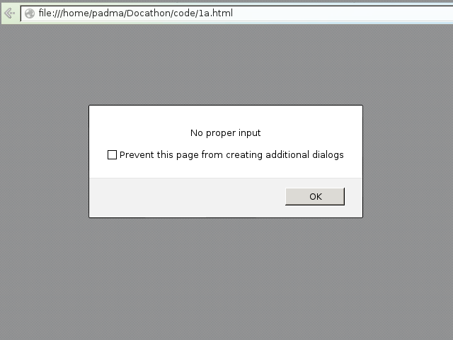

## 1. Develop and demonstrate a XHTML file that includes JavaScript script for the following problems:
### a) Input: A number n obtained using prompt
### Output: The first n Fibonacci numbers
### b) Input: A number n obtained using prompt
### Output: A table of numbers from 1 to n and their squares using alert
***

### Tags used:
     
     	</body>
     </html>

### Output:
*Steps for checking output-*

* Locate the file in the filesystem.
* `Right-click` on the file and select `open-with` firefox/iceweasel/chromium/chrome.
* Input the value and observe the output.

### Screenshots:

### Code: 
*1b.html*

     <html>
    	<body>
     		
    	</body>
     </html>

### Output:
*Steps for checking output-*

* Locate the file in the filesystem.
* `Right-click` on the file and select `open-with` firefox/iceweasel/chromium/chrome.
* Input the value and observe the output.

### Screenshots:

