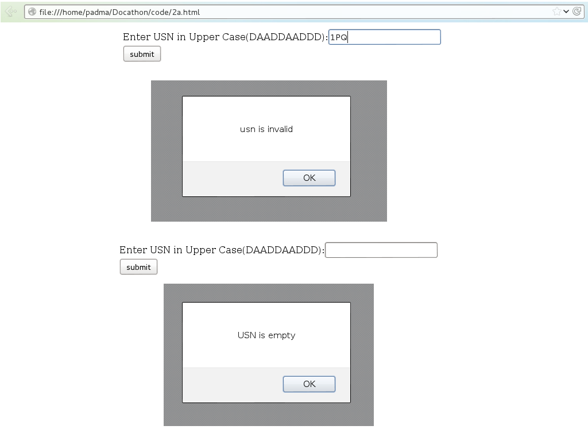
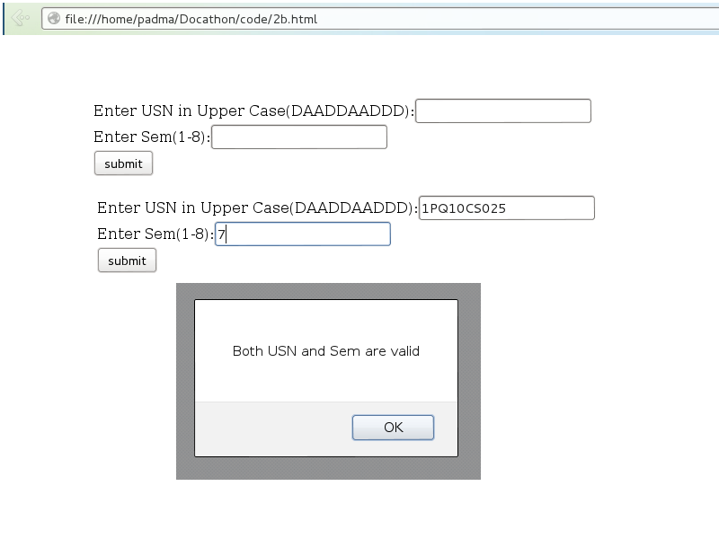
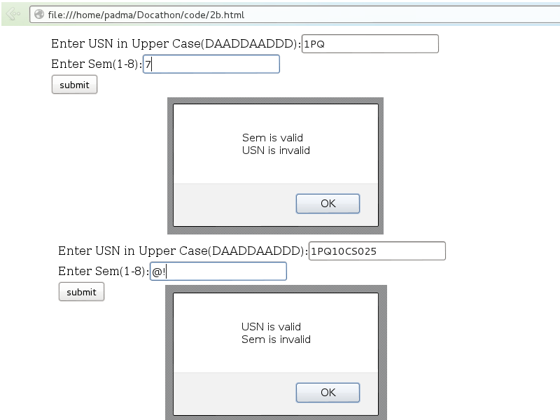
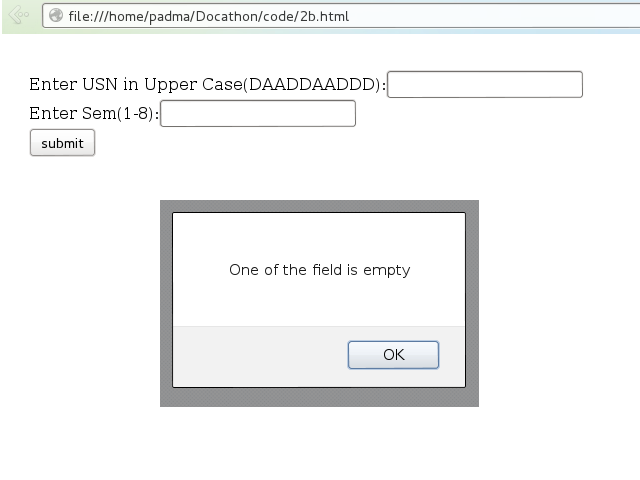

## Program 2:
### a) Develop and demonstrate, using Javascript script, a XHTML document that collects the USN ( the valid format is: A digit from 1 to 4 followed by two upper-case characters followed by two digits followed by two upper-case characters followed by three digits; no embedded spaces allowed) of the user. Event handler must be included for the form element that collects this information to validate the input. Messages in the alert windows must be produced when errors are detected.
### b) Modify the above program to get the current semester also (restricted to be a number from 1 to 8).
***

### Tags used:
     finder - It is a variable which takes function() as a parameter and executes the entire code as if a single statement.
     onsubmit - The onsubmit event occurs when the submit button in a form is clicked.

### Code:
*2a.html*

     <html>
     	<body>
     			
     		<!-- create a form to accept input & pass the input to the function finder() on submission of the form -->
     		<form onsubmit=finder()>
     			Enter USN in Upper Case(DAADDAADDD):<input id=usn type=text> 
     			<input type=submit value=submit>
     		</form>
     	</body>
     </html>

### Output:
*Steps for checking output-*

* Locate the file in the filesystem.
* `Right-click` on the file and select `open-with` firefox/iceweasel/chromium/chrome.
* Input the value and observe the output.

### Screenshots:

### Code:
*2b.html*

     <html>
     	<body>
     			
     		<!-- create a form to accept inputs & pass the input to the function finder() on submission of the form -->
     		<form onsubmit=finder()>
     			Enter USN in Upper Case(DAADDAADDD):<input type=text id=usn> 
     			Enter Sem(1-8):<input type=text id=sem> 
     			<input type=submit value=submit>
     		</form>
     	</body>
     </html>

### Output:
*Steps for checking output-*

* Locate the file in the filesystem.
* `Right-click` on the file and select `open-with` firefox/iceweasel/chromium/chrome.
* Input the value and observe the output.

### Screenshots:

