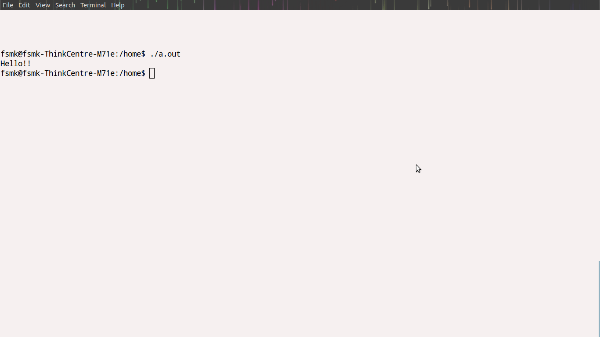

##Aim :
###Write a C/C++ program to set up a real-time clock interval timer using the alarm API.

##Theory :
<ul>
<li>First, every signal has a name. These names all begin with the three characters SIG .For example,SIGABRT is the abort signal that is generated when a process calls the abort function.</li>
<li>SIGALRM is the alarm signal that is generated when the timer set by the alarm function goes off.</li>
<li>Use the alarm API for generating a signal after certain time interval as specified by the user.</li>
</ul>
##Code :
<pre><code>
 #include&lt;stdio.h&gt;
 #include&lt;stdlib.h&gt;
 #include&lt;unistd.h&gt;
 #include&lt;signal.h&gt;
 #define INTERVAL 5
 void callme(int sig_no)
 {
        alarm(INTERVAL);
        printf("Hello!!\n");
 }
 int main()
 {
        struct sigaction action;
        action.sa_handler=(void(*)(int))callme;
        sigaction(SIGALRM,&action,0);
        alarm(2);
        sleep(5);
        return 0;
 }

##Output :
<ol>
<li>Open a terminal.</li>
<li>Change directory to the file location in both the terminals.</li>
<li>Open a file using command followed by program_name <pre>vi 10_alarm_signal_handler.cpp </pre> and then enter the source code and save it.</li>
<li>Then compile the program using <pre>g++ 10_alarm_signal_handler.cpp</pre></li>
 <li>If there are no errors after compilation execute the program using <pre>./a.out</pre> </li>
</ol>

##Screenshot:-
